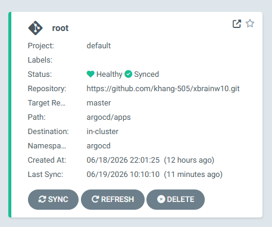
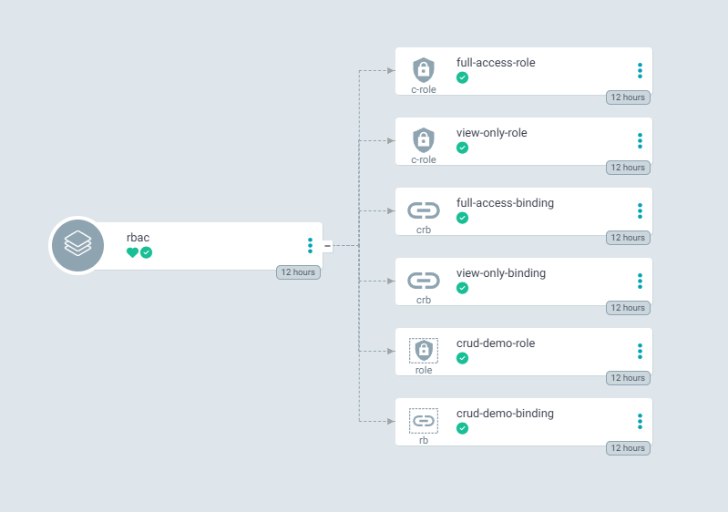
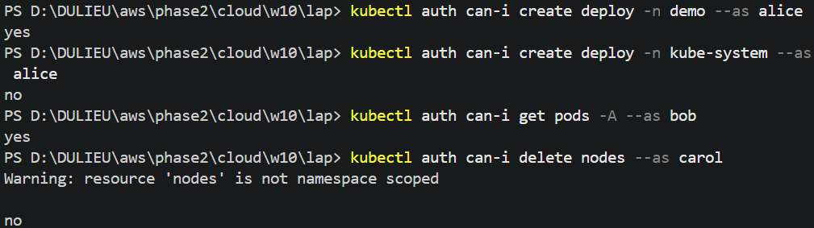
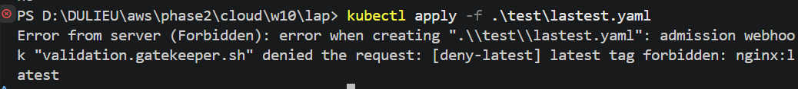
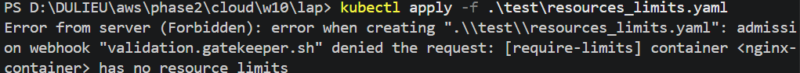
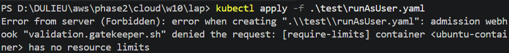
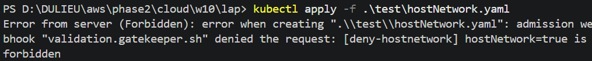
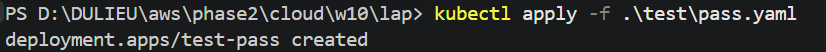
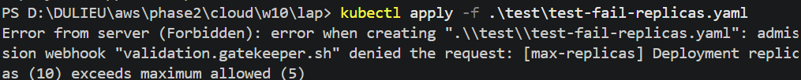

# REPORT EVIDENCE: GITOPS RBAC & GATEKEEPER POLICIES

## 🛠️ Trạng thái Hệ thống Ban đầu (ArgoCD Root)

Trước khi triển khai các cấu hình chi tiết, hệ thống đã nhận diện repo fork mới và đồng bộ thành công cấu hình nền tảng.

> **Minh chứng:** Ảnh chụp ArgoCD dashboard hiển thị `root` app đã đổi `repoURL` thành công và đang ở trạng thái xanh.

---

## 🔐 Lab 1.1: Phân quyền 3 Vai trò qua GitOps (RBAC)

Hệ thống đã triển khai 3 vai trò (`alice`, `bob`, `carol`) hoàn toàn qua GitOps (thư mục `rbac/` và ứng dụng `argocd/apps/rbac.yaml`). Không sử dụng lệnh `kubectl apply` thủ công.

### 1. Trạng thái đồng bộ trên ArgoCD

### 2. Kết quả kiểm tra ma trận phân quyền (Impersonation)

Chạy các lệnh `kubectl auth can-i` để giả lập user và đối chiếu với kỳ vọng:

| STT | Lệnh kiểm tra | Kết quả thực tế | Kỳ vọng | Trạng thái |
|---|---|---|---|---|
| 1 | `kubectl auth can-i create deployments -n demo --as alice` | **yes** / no | yes | ✅ Đạt |
| 2 | `kubectl auth can-i create deployments -n kube-system --as alice` | yes / **no** | no | ✅ Đạt |
| 3 | `kubectl auth can-i get pods -A --as bob` | **yes** / no | yes | ✅ Đạt |
| 4 | `kubectl auth can-i delete nodes --as carol` | yes / **no** | no | ✅ Đạt |

### 3. Hình ảnh minh chứng terminal
> **Cách chụp:** Mở terminal tại thư mục gốc repo và chạy các lệnh `kubectl auth can-i` nêu trên.

---

## 🛡️ Lab 1.2: OPA Gatekeeper (4 Built-in Constraints)

Đã cài đặt OPA Gatekeeper thông qua GitOps (`argocd/apps/gatekeeper.yaml`) với cơ chế `sync-wave` để đảm bảo Controller lên trước, sau đó mới đến ConstraintTemplate và Constraints.

### 1. Trạng thái đồng bộ của Gatekeeper trên ArgoCD
[CHỤP ẢNH: Thể hiện App Gatekeeper và App quản lý Constraints đã được Sync hoàn toàn, không bị lỗi lặp vòng lặp (looping)]

### 2. Nghiệm thu chặn Manifest vi phạm

Dưới đây là kết quả thử nghiệm deploy các manifest 

#### Luật 1: Cấm image tag `:latest` (Risk F-01)
* **Lệnh thử nghiệm:** `kubectl apply -f test/lastest.yaml `
* **Kết quả:** Bị API Server từ chối (Rejected).
* 

#### Luật 2: Bắt buộc có `resources.limits` (Risk F-02)
* **Lệnh thử nghiệm:** `kubectl apply -f test/resources_limits.yaml `
* **Kết quả:** Bị API Server từ chối (Rejected).
* 

#### Luật 3: Cấm `runAsUser: 0` (Chạy root - Risk F-04)
* **Lệnh thử nghiệm:** `kubectl apply -f test/runAsUser.yaml `
* **Kết quả:** Bị API Server từ chối (Rejected).
* 

#### Luật 4: Cấm `hostNetwork: true`
* **Lệnh thử nghiệm:** `kubectl apply -f test/hostNetwork.yaml `
* **Kết quả:** Bị API Server từ chối (Rejected).
* 

#### Thử nghiệm Manifest HỢP LỆ (Pass)
* **Lệnh thử nghiệm:** `kubectl apply -f test/pass.yaml`
* **Kết quả:** Manifest hợp lệ không bị từ chối bởi Gatekeeper.

---

---

## 🎨 Lab 1.3: Custom Policy (Rego)

Hiện tại repo có policy Rego custom max replica là 5. Các policy Gatekeeper hiện có nằm trong:

- `gatekeeper/templates/`
- `gatekeeper/constraints/`

---

## 🏁 Tổng kết Kiểm tra cuối cùng
* Toàn bộ Cluster nền tảng (Platform W9) vẫn duy trì trạng thái **Healthy** trên ArgoCD sau khi áp dụng chế độ `deny` (Không bị sập do chính các tài nguyên hệ thống vi phạm luật).
* Không có bất kỳ hành động `kubectl apply` bằng tay nào đối với các cấu hình gốc (Tất cả được đồng bộ tự động từ Git).

