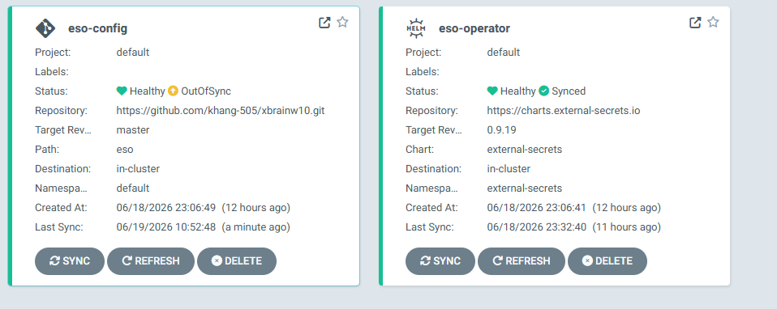
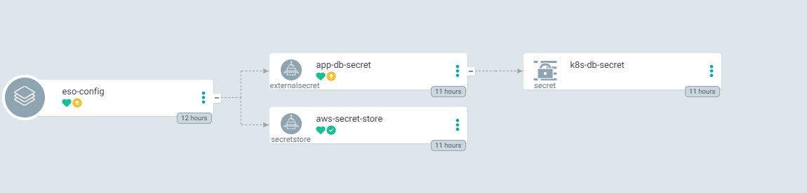
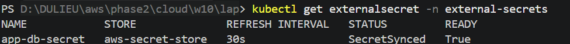
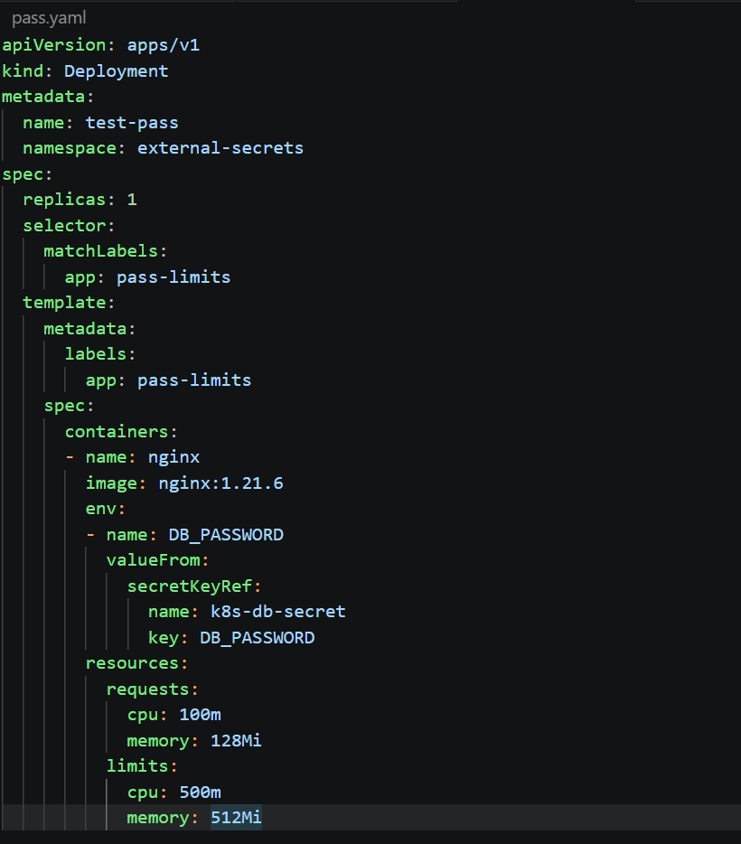
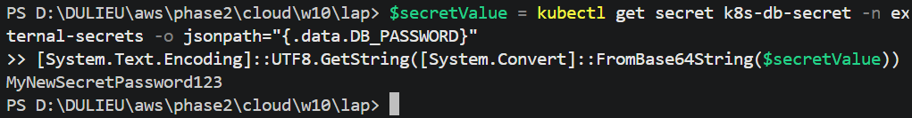
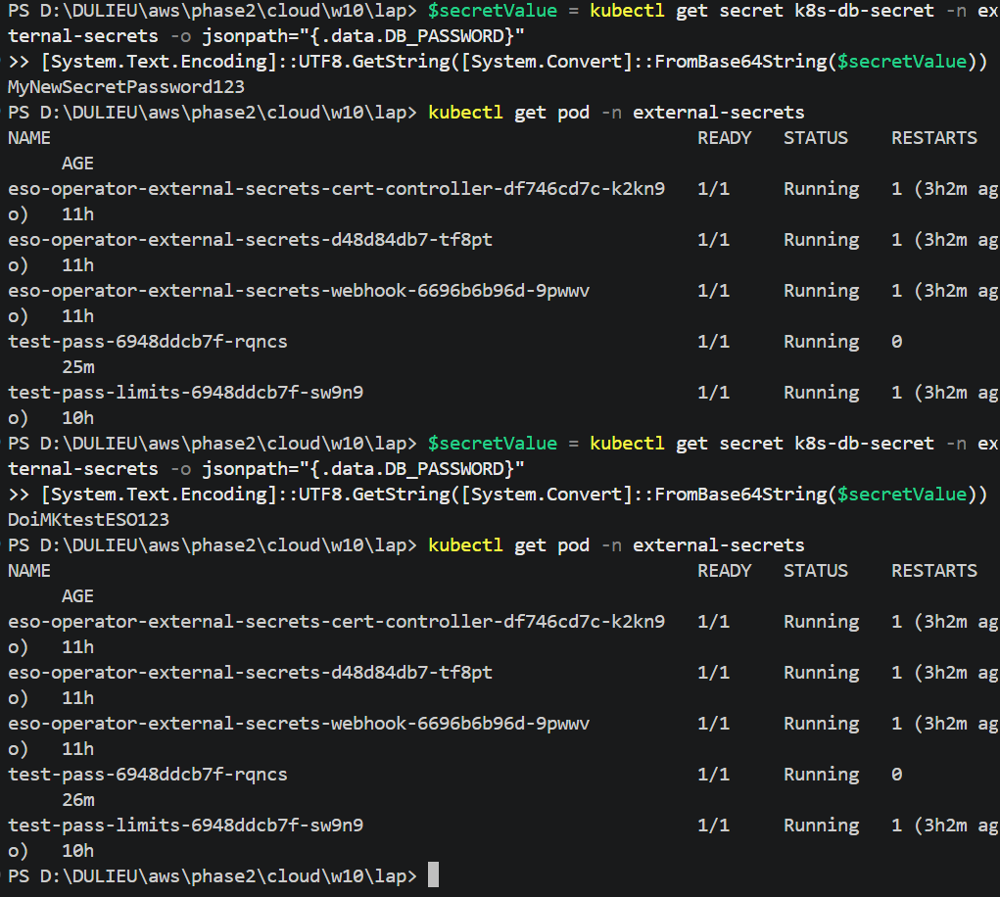
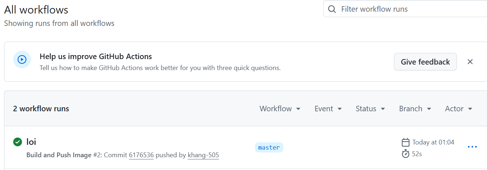
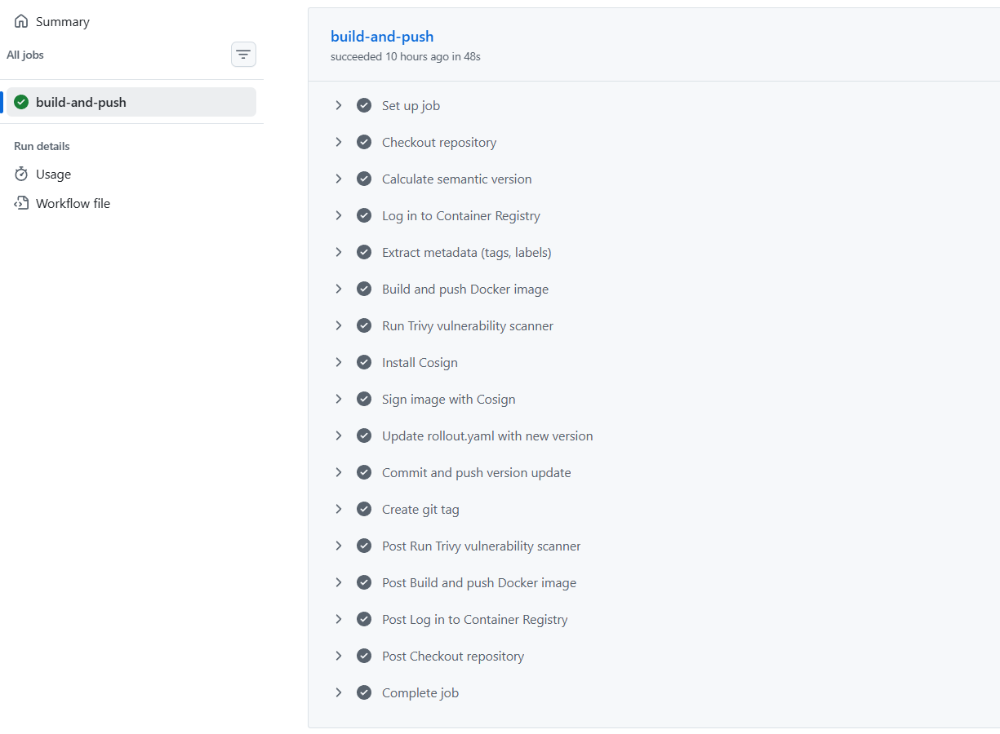
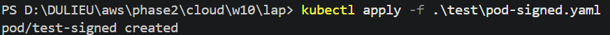
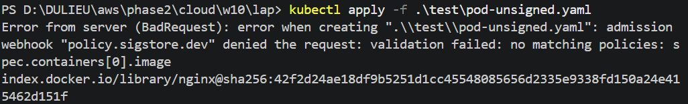

# REPORT EVIDENCE: LAB 2 - SECRETS ROTATION & SUPPLY CHAIN SECURITY

- **Người thực hiện:** [Tên của bạn]
- **Repository Link:** [Dán link repo của bạn tại đây]
- **Trạng thái ArgoCD:** `Synced` & `Healthy` cho các thành phần Lab 2

---

## 🔑 Phần 1: Secrets Rotation (AWS Secrets Manager + ESO)

Mục tiêu: Đảm bảo Secret được lưu an toàn trên AWS Secrets Manager, đồng bộ tự động về Cluster thông qua External Secrets Operator (ESO) với chu kỳ kiểm tra < 60 giây và cập nhật ứng dụng mà không cần restart Pod.

### 1. Trạng thái đồng bộ của ESO trên ArgoCD
Hệ thống đã triển khai ESO Controller và cấu hình `SecretStore` / `ExternalSecret` qua GitOps.

- File cấu hình `eso/secret-store.yaml` tạo `SecretStore` tên `aws-secret-store`.
- File cấu hình `eso/external-secret.yaml` tạo `ExternalSecret` tên `app-db-secret` và đẩy về `Secret` `k8s-db-secret` trong namespace `external-secrets`.




### 2. Kiểm tra tài nguyên K8s Secret được sinh ra tự động
Chạy lệnh kiểm tra tài nguyên ESO trong namespace `external-secrets`:
```bash
kubectl get externalsecret,secret -n external-secrets
kubectl describe externalsecret app-db-secret -n external-secrets
kubectl get secret k8s-db-secret -n external-secrets
```

Kết quả cho thấy `ExternalSecret` đã lấy giá trị từ AWS Secrets Manager và tạo `Secret` Kubernetes tương ứng.




### 3. Chứng minh cập nhật Secret không cần restart Pod

Để chứng minh rằng hệ thống Secret Rotation của chúng ta không gây gián đoạn (zero-downtime) cho ứng dụng, tôi đã thực hiện quy trình kiểm tra "Live Update":


- pod gắn dbpassword khi chạy

- mật khẩu lúc trước 

- sau đổi mật khẩu trên aws, pod vẫn chạy mà không bị restart 
> **Chứng minh:** Giá trị password trả về là **giá trị mới nhất** từ AWS, trong khi `AGE` của Pod vẫn giữ nguyên (không bị restart). Điều này khẳng định hệ thống đạt tiêu chuẩn **High Availability** và an toàn trong vận hành bảo mật.
---
## 🔐 Phần 2: Supply Chain Security (Cosign & ClusterImagePolicy)

Mục tiêu: Thiết lập chuỗi cung ứng phần mềm an toàn bằng cách build image, ký bằng Cosign, và áp dụng chính sách chỉ cho phép image đã ký chạy trên cluster.

### 1. GitHub Actions build và ký image
Repo sử dụng workflow `.github/workflows/build-push.yml` để:

- build Docker image từ `src/api`
- push image lên GitHub Container Registry `ghcr.io`
- scan với Trivy
- cài đặt Cosign
- ký image với khóa `COSIGN_PRIVATE_KEY`
- cập nhật `app-api/rollout.yaml`




### 2. Chính sách xác thực image đã ký
Chính sách `policies/cluster-image-policy.yaml` bật `ClusterImagePolicy` của Sigstore và dùng public key trong `signing/cosign.pub`.

- `ClusterImagePolicy` kiểm tra ảnh `ghcr.io/khang-505/w10-api:*`
- `cosign.pub` là public key để xác thực chữ ký

### 3. Thử nghiệm Pod đã ký và không ký
Sử dụng hai manifest test để xác nhận admission policy:

- `test/pod-signed.yaml` -> image đã ký
- `test/pod-unsigned.yaml` -> image không ký

Lệnh kiểm tra:
```bash
kubectl apply -f test/pod-signed.yaml
kubectl apply -f test/pod-unsigned.yaml
```

Kết quả mong đợi:

- `test/pod-signed` được chấp nhận và tạo thành công.
- `test/pod-unsigned` bị từ chối bởi policy xác thực ảnh.




---

## 🧾 Tổng kết Lab 2

* ESO đã đồng bộ `SecretStore` và `ExternalSecret` qua GitOps, tạo `Secret` Kubernetes tự động.
* GitHub Actions đã build và ký image bằng Cosign.
* ClusterImagePolicy đã được cấu hình để chỉ cho phép image đã ký chạy, giúp bảo vệ chuỗi cung ứng phần mềm.


